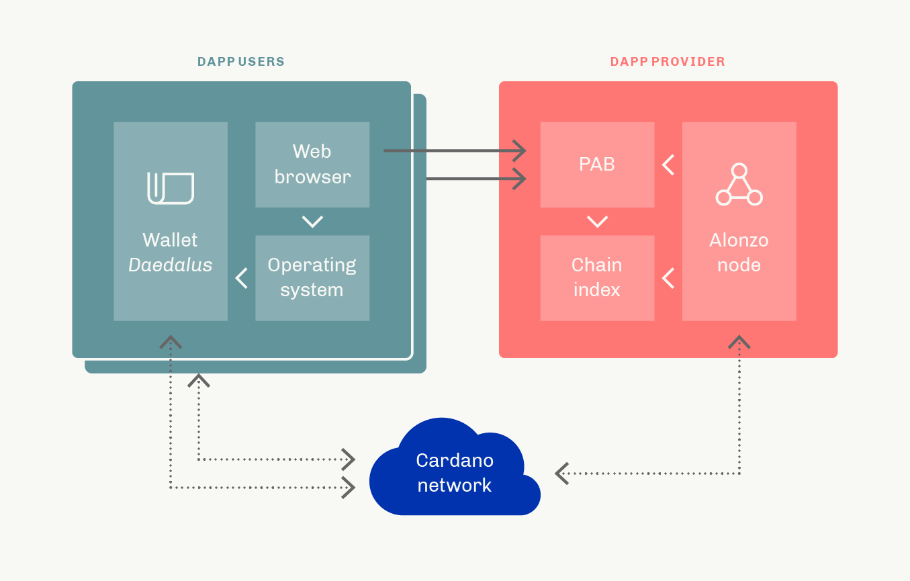

## Plutus Application Backend (PAB) explainer ##

The Plutus Application Backend (PAB) enables developers to interact with smart contracts. It is an off-chain, backend service for managing and handling the requirements of the application instance throughout its lifecycle. This service includes interaction with external clients (such as wallet frontends) and acts as an intermediary between Plutus applications, the node, the wallet backend, and end users. Such interaction is made possible by PAB commands and mock components that enable convenient simulations and integration of DApps. We will be rolling out a series of versions of the PAB over the coming weeks as we iterate and add new functionality.

The purpose of the PAB is to:
- provide a standardized environment in which Plutus applications run
- provide disciplined state management
- present discoverable interfaces to the external clients
- track on-chain information for smart contract uses
- work in an emulated environment
- deal with requests such as running contract instances, forwarding user input to these instances, and notifying these instances of ledger state change events.

The following diagram provides an overview of the PAB architecture:

There are two deployment models envisaged for the PAB once it is available:
- hosted - this option will be supported at the initial release of the PAB. In this scenario, the DApp provider / developer hosts an instance of the PAB alongside the chain index and an Alonzo node. The off-chain code of the Plutus app is run on the DApp provider’s infrastructure.
- in-browser - this option will be available later, after the initial release. 

In addition to the PAB itself, the following components are required:
- Chain index — the chain index is a database of data gathered from Cardano transactions. It uses the Cardano node’s chain sync protocol and needs to be co-located with a Cardano node. The chain index is a read-only component for the PAB. Multiple instances of the PAB can therefore share a single instance of the chain index. All chain index queries are served over an HTTP API.
- Alonzo node — the PAB subscribes to ledger state updates from the node, using a socket protocol.

The PAB is another powerful tool on Cardano that makes DApps simpler, more secure, and more cost-effective to develop. By providing information from canonical sources in a usable form, it relieves developers of many routine tasks.
