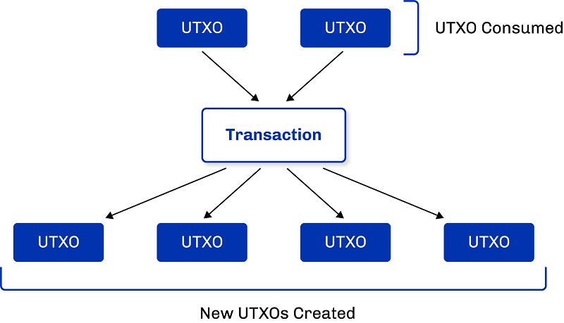

# About the Extended UTXO (EUTXO) model

Cardano (like Bitcoin) is an Unspent Transaction Output (UTXO)-based blockchain, which utilizes a different accounting model for its ledger from other account-based blockchains like Ethereum. Cardano implements an innovative [Extended Unspent Transaction Output (EUTXO) model](https://iohk.io/en/blog/posts/2021/03/11/cardanos-extended-utxo-accounting-model/), which is introduced by the Alonzo upgrade to support multi-assets and smart contracts.  

## Overview of the UTXO model ##
In the UTXO model, a transaction has *inputs* and *outputs*, where the inputs are unspent outputs from previous transactions. Assets are stored on the ledger in unspent outputs, rather than in accounts. 

As soon as an output is used as input in a transaction, it becomes spent and can never be used again. The output is specified by an address (a public key or public key hash) and a value (consisting of an ada amount and any optional additional native token amounts). 
An output’s address determines which transactions are allowed to ‘unlock’ the output and use it as an input. A transaction must be signed by the owner of the private key corresponding to the address. Think of an address as a ‘lock’ that can only be ‘unlocked’ by the right ‘key’ ‒ the correct signature.

Each of these outputs specifies quantities of assets stored therein, together with its address. Unspent outputs are immutable, so a transaction might consume the entire output, but it cannot alter it.

In summary, transactions consume unspent outputs from previous transactions, and produce new outputs that can be used as inputs for future transactions, as outlined here:

The users' wallets manage these UTXOs and initiate transactions involving the UTXOs owned by the user. Every blockchain node maintains a record of the subset of all UTXOs at all times. This is called the UTXO set. In technical terms, this is the chainstate, which is stored in the data directory of every node. When a new block is added to the chain, the chainstate is updated accordingly. This new block contains the list of latest transactions (including, of course, a record of spent UTXOs, and new ones created since the chainstate was last updated). Every node maintains an exact copy of the chainstate.

## Cardano’s extended UTXO model ##
The EUTXO model extends the UTXO model in two ways:
1. It generalizes the concept of ‘address’ by using the lock-and-key analogy. Instead of restricting locks to public keys and keys to signatures, addresses in the EUTXO model can contain arbitrary logic in the form of scripts. For example, when a node validates a transaction, the node determines whether or not the transaction is allowed to use a certain output as an input. The transaction will look up the script provided by the output's address and will execute the script if the transaction can use the output as an input.
2. The second difference between UTXO and EUTXO is that outputs can carry (almost) arbitrary data in addition to an address and value. This makes scripts much more powerful by allowing them to carry state information.

Furthermore, EUTXO extends the UTXO model by allowing output addresses to contain complex logic to decide which transactions can unlock them, and by adding custom data to all outputs. When validating an address, the script will access the data being carried by the output, the transaction being validated, and some additional pieces of data called redeemers, which the transaction provides for every input. By looking up all this information, the script has enough context to give a ‘yes’ or ‘no’ answer in what can be highly complex situations and use cases.

EUTXO enables arbitrary logic in the form of scripts. This arbitrary logic inspects the transaction and the data to decide whether the transaction is allowed to use an input or not.

The UTXO model with its graph structure is fundamentally different from the account-based model used by some existing smart-contract enabled blockchains. As a result, the design patterns that work for DApps on account-based blockchains do not translate directly to Cardano. New design patterns are needed because the underlying representation of the data is different.

EUTXO	 inherits the per-branches design of the UTXO (Bitcoin) model, where one branch is by definition a sequence of transactions that requires a sequence of validations. To split the logic across different branches and enforce more parallelism, it is essential to build DApps and other solutions using multiple UTXOs. This provides benefits in terms of scaling, just like developing Bitcoin services prerequisites splitting one wallet into sub wallets. 

## Advantages of EUTXO ##
Cardano’s EUTXO model provides a secure and versatile environment to process multiple operations without system failures. This model offers better scalability and privacy, as well as more simplified transaction logic, as each UTXO can only be consumed once and as a whole, which makes transaction verification much simpler.

The EUTXO model offers unique advantages over other accounting models. The success or failure of transaction validation depends only on the transaction itself and its inputs, and not on anything else on the blockchain. As a consequence, the validity of a transaction can be checked off-chain, before the transaction is sent to the blockchain. A transaction can still fail if some other transaction concurrently consumes an input that the transaction is expecting, but if all inputs are still present, the transaction is guaranteed to succeed.

This contrasts with an account-based model (as used by Ethereum), where a transaction can fail in mid-script execution. This can never happen in EUTXO. 

Due to the ‘local’ nature of transaction validation, a high degree of parallelism is possible. A node could, in principle, validate transactions in parallel, if those transactions do not try to consume the same input. This is great both for efficiency and for reasoning, simplifying the analysis of possible outcomes, and proving that ‘nothing bad’ can happen. You can dive deeper into the EUTXO model blog post.

A powerful feature of the EUTXO model is that the fees required for a valid transaction can be predicted precisely prior to posting it. This is a unique feature not found in account-based models. Account-based blockchains, like Ethereum, are indeterministic, which means that they cannot guarantee the transaction’s effect on-chain. This uncertainty presents risks of monetary loss, unexpectedly high fees, and additional opportunities for adversarial behavior.

To summarize, EUTXO offers greater security, smart contract execution cost predictability (without unpleasant surprises) and more powerful parallelization. 
