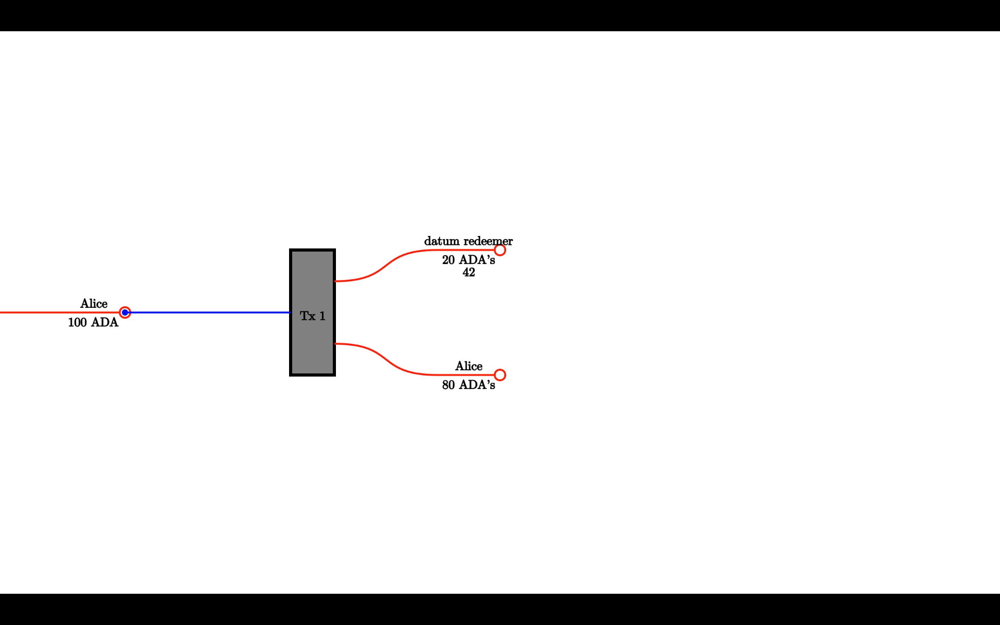
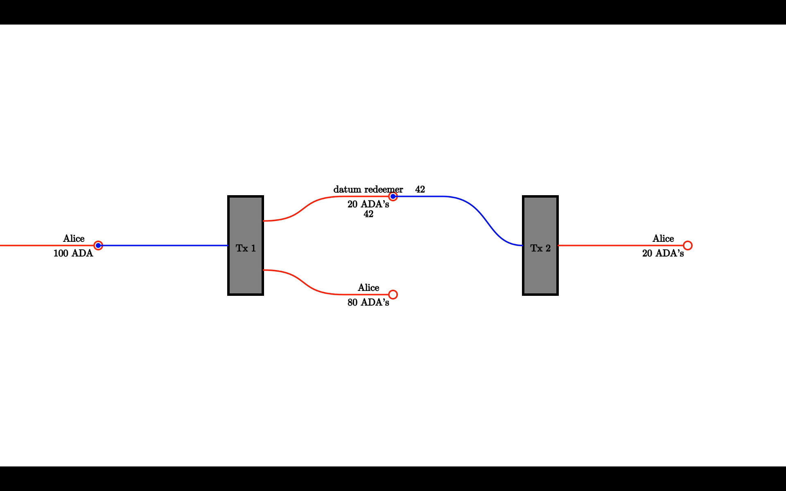

## Datums and redeemers tutorial

This tutorial explains the concepts of Plutus datums and redeemers, and outlines how to work with these elements when submitting transactions.

The **datum** is a piece of information that can be associated with a UTXO and is used to carry script state information such as its owner or the timing details (which define when the UTXO can be spent). It is frequently used in combination with a **redeemer** – arbitrary information included in a transaction to provide an input to the script. 

### Two-phase transaction validation

Inputs are unspent outputs from previous transactions. The datum hash and a value (consisting of an ada amount and optional, additional native token amounts) are stored in a UTXO at an address (public key or public key hash). When a UTXO at a script address is an input to a valid transaction, the script determines whether to ‘unlock’ the funds. This can be executed under specific conditions defined by the script (an arbitrary combination of factors including datum, redeemer, and script context). During the first validation phase, a transaction must be signed by the owner of the private key corresponding to the address.

There are a couple of concepts that we need to learn before understanding a redeemer transaction:
1. Script address — the Cardano address that stores funds guarded by a Plutus script that can be further unlocked. It is a hash of the Plutus script.
2. Datum hash — in Cardano, the datum hash needs to be attached to a UTXO at a script address. This is done to reduce memory requirements and enable rapid access whilst validating transactions.
3. Plutus script — executable program used in the ledger to perform additional (phase two) transaction validation. 
4. Datum value — when sending a transaction to redeem funds, we need to send the *datum value* that matches with the *datum hash* sent in the locking transaction.
5. Redeemer value — uses the same arbitrary data format as datum. Redeemer value is attached to the input transaction to unlock funds from a script and is used by the script to validate the transaction.
6. Script context — a summary of the transaction, which is also needed in the Plutus script to validate the transaction.

The process of working with datums and redeemers is the following:
Let’s say that Alice has a UTXO with 100 ADAs:


And she wants to lock 20 ADAs to the “datum-redeemer” script. She can do that by sending a transaction attaching an arbitrary data (i.e. the number 42) to the new UTXO:


Finally, someone could spend the 20 adas with a new transaction, this time a redeemer has to be specified:


### Hello world

The most simple example of working with datums and redeemers is to:

1. Lock a UTXO in a script address by attaching a hash of the datum to it
2. Then, unlock the funds with a redeemer that corresponds to the datum. 

This is expressed in the following contract:

```
helloWorld :: Data -> Data -> Data -> ()
helloWorld datum redeemer context = if datum P.== redeemer
                                      then ()
                                      else (P.error ())
```

The function above receives three arguments: *datum*, *redeemer*, and *script context*. However, we use the datum and the redeemer only.

### Prerequisites
The Plutus script needs to be built with GHC 8.10.4. One way to install this specific version is to use [ghcup](https://gitlab.haskell.org/haskell/ghcup-hs). Another way is to use Nix. 

### Compiling the contract
In this tutorial, we are going to modify one of the examples of the [Alonzo testnet repository](https://github.com/input-output-hk/Alonzo-testnet). See the following steps:

1. Clone the [Alonzo testnet repository](https://github.com/input-output-hk/Alonzo-testnet).
2. Go to `Alonzo-testnet/resources/plutus-sources/plutus-helloworld` directory.
3. In the file `src/cardano/PlutusExample/HelloWorld.hs` change the line 
`helloWorld datum redeemer context = if datum P.== hello then () else (P.error ())`
with:
`helloWorld datum redeemer context = if datum P.== redeemer then () else (P.error ())`.
4. Compile the code with the command `cabal run plutus-helloworld -- 42 datum-redeemer.plutus`.
5. The result is a file named `datum-redeemer.plutus`. 


### Creating the script address
Now that we have compiled the contract, we need to create the script address. For this, use the following cardano-cli command: 

```
$ cardano-cli address build --payment-script-file datum-redeemer.plutus --testnet-magic 8 --out-file datum-redeemer.addr
```

### Querying the script address
Now that we have the script address, we can see and query it using the following commands:

```
$ cat datum-redeemer.addr 
addr_test1wrj2yjcjnpl37fnv74lcwgtc5meefznj490gp2kkuquwt0c84ezsu


$ cardano-cli query utxo --address $(cat datum-redeemer.addr) --testnet-magic 8
                           TxHash                                 TxIx        Amount
--------------------------------------------------------------------------------------
```

### Calculating the datum hash
To send a transaction to the network, we need the *datum hash*. This is the hash of arbitrary data. In this example, we use `42` as the datum. To compute the hash of `42`, we use the following command:

```
$ cardano-cli transaction hash-script-data --script-data-value 42
9e1199a988ba72ffd6e9c269cadb3b53b5f360ff99f112d9b2ee30c4d74ad88b
``` 

### Querying personal UTXOs
First, we need to query the address that will send the funds to the script address. In this example, we have the address in the file `payment.addr`:

```
$ cardano-cli query utxo --address $(cat payment.addr) --testnet-magic 8
                           TxHash                                 TxIx        Amount
--------------------------------------------------------------------------------------
cd4a34a97e8845631c57ec21fed3901e4a4f244e0673eb9e5d478437ec3e9bf4     1        1000000 lovelace + TxOutDatumHashNone
d26ccb16e17b7db97b9578c5f787baaeb63e36dc78134e926bdaeb58a512018d     0        999664124755 lovelace + TxOutDatumHashNone
d26ccb16e17b7db97b9578c5f787baaeb63e36dc78134e926bdaeb58a512018d     1        100000000 lovelace + TxOutDatumHashNone


```

We use the UTXO that contains 100 ada (d26ccb16e17b7db97b9578c5f787baaeb63e36dc78134e926bdaeb58a512018d#1), and using the build command the fee will be calculated automatically.

### Downloading the protocol parameters file
Before sending our first transaction we need to download the file that contains the parameters of the protocol, we do that with the following command:
```
$ cardano-cli query protocol-parameters --out-file protocol.json --testnet-magic 8
```

### Locking funds
To lock a UTXO guarded by a Plutus script, we need to send a transaction to the Cardano network with an attached datum hash. To do that, we first need to build the transaction:

```
cardano-cli transaction build \
--alonzo-era \
--tx-in 
d26ccb16e17b7db97b9578c5f787baaeb63e36dc78134e926bdaeb58a512018d#1 \
--tx-out $(cat datum-redeemer.addr)+20000000 \
--tx-out-datum-hash 9e1199a988ba72ffd6e9c269cadb3b53b5f360ff99f112d9b2ee30c4d74ad88b \
--change-address $(cat payment.addr) \
--protocol-params-file protocol.json \
--out-file tx.raw \
--testnet-magic 8
```

As it is an Alonzo-era transaction, we need to specify the `--alonzo-era` flag.

**Ordering of some CLI options matters**. When locking a UTXO with a Plutus script, we must provide the `--tx-out-datum-hash` right after the `--tx-out` that is given to the script address. A UTXO at a script address without an attached datum hash is locked forever! 

You can find steps on how to create a transaction on the Alonzo era network in the Plutus transactions using cardano-cli.  

### Querying the script address
The UTXO at this script address should now have 8 ada and the datum hash attached. To query it, run:

```
$ cardano-cli query utxo --address $(cat datum-redeemer.addr) --testnet-magic 8
                           TxHash                                 TxIx        Amount
--------------------------------------------------------------------------------------
49ac2bf6a40df00d071b649d1e5b5d3531ddb2bfe6c619f9506cacb557bcb8b6     1        20000000 lovelace + TxOutDatumHash ScriptDataInAlonzoEra "9e1199a988ba72ffd6e9c269cadb3b53b5f360ff99f112d9b2ee30c4d74ad88b"

```

### Wrong redeemer 
We are going to test the contract by sending the wrong redeemer. Let’s remember the contract:

```
helloWorld :: Data -> Data -> Data -> ()
helloWorld datum redeemer context = if datum P.== redeemer
                                      then ()
                                      else (P.error ())
```

This contract succeeds when the datum is equal to the redeemer. We have just locked funds using  the datum hash for the value of `42`. We will now use a different value of the redeemer, `43` for example.

To do that, we need to send a transaction that tries to unlock funds from the script address. We need the UTXO from the script address:

```
$ cardano-cli query utxo --address $(cat datum-redeemer.addr) --testnet-magic 8
                           TxHash                                 TxIx        Amount
--------------------------------------------------------------------------------------
49ac2bf6a40df00d071b649d1e5b5d3531ddb2bfe6c619f9506cacb557bcb8b6     1        20000000 lovelace + TxOutDatumHash ScriptDataInAlonzoEra "9e1199a988ba72ffd6e9c269cadb3b53b5f360ff99f112d9b2ee30c4d74ad88b"


$ cardano-cli query utxo --address $(cat payment.addr) --testnet-magic 8
                           TxHash                                 TxIx        Amount
--------------------------------------------------------------------------------------
49ac2bf6a40df00d071b649d1e5b5d3531ddb2bfe6c619f9506cacb557bcb8b6     0        79831551 lovelace + TxOutDatumHashNone
cd4a34a97e8845631c57ec21fed3901e4a4f244e0673eb9e5d478437ec3e9bf4     1        1000000 lovelace + TxOutDatumHashNone
d26ccb16e17b7db97b9578c5f787baaeb63e36dc78134e926bdaeb58a512018d     0        999664124755 lovelace + TxOutDatumHashNone


```

We also need a UTXO to be used as collateral and to cover the fees. 

> **About collateral:** Collateral has been introduced in Alonzo transactions to cover the cost of the validating node executing a failing script. In this scenario, the provided UTXO is consumed instead of the fees. It is best to provide a UTXO with the minimum ada possible to satisfy the collateral amount. Please note, the collateral amount is likely to be higher than the transaction fee. A UTXO provided for collateral must only have ada, no other native assets.

We will build the transaction using the build command to see what happens. In this example, we use the UTXO containing 1 ada for collateral:

```
$ cardano-cli transaction build \
--alonzo-era \
--tx-in 49ac2bf6a40df00d071b649d1e5b5d3531ddb2bfe6c619f9506cacb557bcb8b6#1 \
--tx-in-script-file datum-redeemer.plutus \
--tx-in-datum-value 42 \
--tx-in-redeemer-value 43 \
--tx-in-collateral cd4a34a97e8845631c57ec21fed3901e4a4f244e0673eb9e5d478437ec3e9bf4#1 \
--change-address $(cat payment.addr) \
--protocol-params-file protocol.json \
--out-file tx.raw \
--testnet-magic 8
Command failed: transaction build  Error: The following scripts have execution failures:
the script for transaction input 0 (in the order of the TxIds) failed with The Plutus script evaluation failed: An error has occurred:  User error:
The provided Plutus code called 'error'.

```

Now we can see that we cannot even create a wrong transaction. The command build first tries the new transaction to see whether it would be validated before it is sent.

### Unlocking funds
The UTXO is still locked, so now we will unlock it. As always, we do that by sending a transaction. In this transaction, we use the UTXO at the script address as an *input*. You can spend a transaction that is not in your address (but rather in a script address) because provided the script is satisfied with all of its conditions, the UTXO it guards will be unlocked. In regular addresses, we use our private key to unlock funds, and in script addresses, we satisfy the script logic to unlock funds. For this script, the redeemer is the key to unlocking our funds. And to do that we build a transaction as follows:

```
$ cardano-cli transaction build \
--alonzo-era \
--tx-in 49ac2bf6a40df00d071b649d1e5b5d3531ddb2bfe6c619f9506cacb557bcb8b6#1 \
--tx-in-script-file datum-redeemer.plutus \
--tx-in-datum-value 42 \
--tx-in-redeemer-value 42 \
--tx-in-collateral cd4a34a97e8845631c57ec21fed3901e4a4f244e0673eb9e5d478437ec3e9bf4#1 \
--change-address $(cat payment.addr) \
--protocol-params-file protocol.json \
--out-file tx.raw \
--testnet-magic 8
```
In this case we were able to build the transaction, since it has the right values. Now we can sign and submit this transaction.
```
$ cardano-cli transaction sign --tx-body-file tx.raw --signing-key-file payment.skey --testnet-magic 8 --out-file tx.sign

$ cardano-cli transaction submit --testnet-magic 8 --tx-file tx.sign
Transaction successfully submitted.
```

### Querying both payment and script addresses
We can query the addresses to ensure that we have unlocked the funds. There is now no UTXO at the script address and a new one with 8 ada has been received.:

```
$ cardano-cli query utxo --address $(cat datum-redeemer.addr) --testnet-magic 8
                           TxHash                                 TxIx        Amount
--------------------------------------------------------------------------------------

$ cardano-cli query utxo --address $(cat payment.addr) --testnet-magic 8
                           TxHash                                 TxIx        Amount
--------------------------------------------------------------------------------------
30ccc513f63452602adf43140e5749a11c6ad14f592acda37bf9683e427971c4     0        19788721 lovelace + TxOutDatumHashNone
49ac2bf6a40df00d071b649d1e5b5d3531ddb2bfe6c619f9506cacb557bcb8b6     0        79831551 lovelace + TxOutDatumHashNone
cd4a34a97e8845631c57ec21fed3901e4a4f244e0673eb9e5d478437ec3e9bf4     1        1000000 lovelace + TxOutDatumHashNone
d26ccb16e17b7db97b9578c5f787baaeb63e36dc78134e926bdaeb58a512018d     0        999664124755 lovelace + TxOutDatumHashNone

```

**JSON format guidelines**
Consider the following guidelines for JSON formats:

+ The JSON passed for `--script-data-value` cannot encode certain constructor forms.
+ Values of `-tx-in-datum-value` and `--tx-in-redeemer-value` were given the same value of `{"constructor":0,"fields":[{"int":42}]}`
+ Be aware of the datum hash that locks the funds

**CLI support**
|The CLI supports two schemas for input data: "precise" and "casual". The `--script-data-file` uses the precise style. As in the example `{"constructor":0,"fields":[{"int":42}]}`, the `--script-data-value` uses the casual style, e.g. `42` rather than `{"int": 42}`.

The precise schema style requires the particular schema. The schemaless style cannot encode constructors.

It rejects floating point numbers (accepts only integers (-2^64-1) .. 2^64-1), and rejects strings over 64 bytes long. 

They're different JSON objects, and hence when both are interpreted in the schemaless style, they correspond to different `Data` values. One is a *number*, the other is an *object* with one field containing a number.

Under the schema-based approach, `42` is not valid (does not fit the schema) and `{"int":42}` would be valid and correspond to a `Data` value consisting of a single integer.
