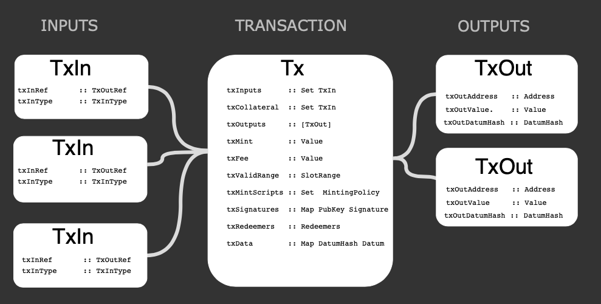

## How to write Plutus transactions 
This tutorial outlines what a Plutus transaction is and how to write one.

### What is a Plutus transaction?
A transaction is a piece of data that contains both inputs and outputs, and as of the Alonzo era, they can also include Plutus scripts. **Inputs** are unspent outputs from previous transactions (UTxO). As soon as an UTxO is used as input in a transaction, it becomes spent and can never be used again. The **output** is specified by an *address* (a public key or public key hash) and a *value* (consisting of an ada amount and optional additional native token amounts). This flow-diagram gives a better idea of what the components of a transaction are at a technical level:

  


  

In short, inputs contain references to UTXOs introduced by previous transactions, and outputs are the new UTXOs that this transaction will produce. Also, if we think about it, this allows us to change the state of a smart contract since new data can be contained in the produced outputs.

  

It is also important to define what a *Plutus Tx* is. Plutus Tx is the name given to specially-delimited sections of a Haskell program that are used to compile the on-chain part of a contract application into Plutus Core (this compiled code is then used for validating a transaction, hence the "Tx"). The resulting Plutus Core expression can be part of transaction data or data stored on the ledger. These pieces of code require special processing on the blockchain and are referred to as *Plutus script*.

  

**Why**

  

From a Plutus developer perspective, by using transactions, we can control the flow of execution of our Plutus script. Thus, a transaction can also be thought of as messages used to interact with the smart contract. Understanding transactions is a key concept to master the development of smart contracts.

  

**When**

  

A transaction ought to be created by the wallet while evaluating the off-chain code. For now, we have to assemble the transaction using cardano-cli and place the compiled Plutus script inside. At later stages though, this will be automated by the user's wallet software. The transaction, once submitted, will be validated and, therefore, the Plutus code will be evaluated by a validator node. If the script evaluates successfully, the transaction will be considered as valid. If not, the transaction will be rejected.

  
  

### Setting up the environment

If you already have a Haskell development environment set up, feel free to skip this section, otherwise follow along, we will set up a suitable environment for compiling plutus scripts using Nix.

  

We will use Nix to provide both Haskell and Cabal, but if you desire, you could also rely on ghcup to manage these dependencies. However, we won't cover this. You can refer to the official [ghcup](https://gitlab.haskell.org/haskell/ghcup-hs) site for instructions on that.

  

Nix is an amazing tool that, among other things, allows us to create isolated environments in which we can embed all dependencies needed for an application. These dependencies can even be system-level dependencies. Thus, we can create an isolated environment to ensure the application will work since all required dependencies are available.

  
  

Install Nix on any **Linux distribution**, **MacOS** or **Windows** (via WSL) via the recommended [multi-user installation](https://nixos.org/manual/nix/stable/#chap-installation). In short, you need to run this at your terminal:

```
$ sh <(curl -L https://nixos.org/nix/install) --daemon
```

Add IOHK Binary Cache. To improve build speed, it is possible to set up a binary cache maintained by IOHK.

  
```
$ sudo mkdir -p /etc/nix

$ cat <<EOF | sudo tee /etc/nix/nix.conf

substituters = https://cache.nixos.org https://hydra.iohk.io

trusted-public-keys = iohk.cachix.org-1:DpRUyj7h7V830dp/i6Nti+NEO2/nhblbov/8MW7Rqoo= hydra.iohk.io:f/Ea+s+dFdN+3Y/G+FDgSq+a5NEWhJGzdjvKNGv0/EQ= cache.nixos.org-1:6NCHdD59X431o0gWypbMrAURkbJ16ZPMQFGspcDShjY=

EOF
```
  

Before Nix works in your existing shells, you need to close them and open them again. Other than that, you should be ready to go.

  

Once Nix is installed, log out and then log back in, so it is activated properly in your shell. Clone the following and check out the Alonzo tag.

  
```
$ git clone https://github.com/input-output-hk/cardano-node
$ cd cardano-node
$ git checkout -b alonzo-purple tags/alonzo-purple-1.0.2
```
 
Save the following into a file called `plutus-tutorial.nix`:

```
{ version ? "purple", magicId ? 8, pkgs ? import <nixpkgs> { }}:
let
cardano-node-repo = import ./. { };

in pkgs.mkShell {
buildInputs = with pkgs; [
libsodium
cabal-install
haskell.compiler.ghc8104
haskellPackages.haskell-language-server
cardano-node-repo.scripts."alonzo-${version}".node
cardano-node-repo.cardano-cli
];

CARDANO_NODE_SOCKET_PATH = "${builtins.toString ./.}/state-node-alonzo-${version}/node.socket";
TESTNET_MAGIC = magicId;
}
```

and then load a shell with Nix using this file with the following command:
```
$ nix-shell plutus-tutorial.nix
```  

This will take approximately five or ten minutes, then, you should see something similar to this:
```
these paths will be fetched (445.08 MiB download, 5870.53 MiB unpacked):

/nix/store/04jc7s1006vhg3qj4fszg6bcljlyap1a-conduit-parse-0.2.1.0-doc

/nix/store/052kzx9p5fl52pk436i2jcsqkz3ni0r2-reflection-2.1.6-doc
.
.
.
/nix/store/7jq1vjy58nj8rjwa688l5x7dyzr55d9f-monad-memo-0.5.3... (34 KB left)

```

This creates an environment with all dependencies listed in the “buildInputs” section, with GHC 8.10.4 and Cabal among those.


When you have recent versions of GHC and Cabal, make sure to use GHC 8.10.2 or later:

```
[nix-shell:~]$ ghc --version
The Glorious Glasgow Haskell Compilation System, version 8.10.4

[nix-shell:~]$ cabal --version
cabal-install version 3.4.0.0
compiled using version 3.4.0.0 of the Cabal library

```

### Running the cardano-node

  

Inside the nix-shell start a passive Cardano node:

```
$ nix-shell plutus-tutorial.nix
[nix-shell:~]$ cardano-node-alonzo-purple
```

At this point, the node will start syncing with the network. We are now ready to start building the Plutus transaction. Keep the node running in this shell, and open a new terminal to continue with the following steps. Remember to enter the nix-shell environment in this new terminal so you have both GHC and Cabal available.

  
  

### Plutus tx: Compiling a Plutus script

  

1. **Clone the `AlwaysSucceeds` Plutus script**. Write a Haskell program that uses it to compile our desired Plutus script, or you can use the source for the project [plutus-alwayssucceeds](https://github.com/input-output-hk/Alonzo-testnet/tree/main/resources/plutus-sources/plutus-alwayssucceeds).


```
[nix-shell:~]$ git clone [https://github.com/input-output-hk/Alonzo-testnet.git](https://github.com/input-output-hk/Alonzo-testnet.git)

[nix-shell:~]$ cd Alonzo-testnet/resources/plutus-sources/plutus-alwayssucceeds
```

 
2. **Compile the plutus-alwayssucceeds project**. This project contains the `AlwaysSucceeds` Plutus script. By building the plutus-alwayssucceeds project, we generate a binary that compiles this script.

 
```
[nix-shell:~/Alonzo-testnet/resources/plutus-sources/plutus-alwayssucceeds]$ cabal update

[nix-shell:~/Alonzo-testnet/resources/plutus-sources/plutus-alwayssucceeds]$ cabal build
```


3. **Execute the plutus-alwayssucceeds project**. We will pick a random number. It will be passed as an argument to the Plutus script (it is not used by the script right now, but will be required by transactions using the script). The second argument is the filename we use for the compiled Plutus script.

  

```
$ cabal run plutus-alwayssucceeds -- 42 alwayssucceeds.plutus
```

 
You should see something like this:

```
Up to date

Writing output to: alwayssucceeds.plutus

"Log output"

[]

"Ex Budget"

ExBudget {_exBudgetCPU = ExCPU 1390000, _exBudgetMemory = ExMemory 100}

 
[nix-shell:~/Alonzo-testnet/resources/plutus-sources/plutus-alwayssucceeds]$ cat alwayssucceeds.plutus

{
"type": "PlutusScriptV1",
"description": "",
"cborHex": "4e4d01000033222220051200120011"
}
```

  

We will then have the Plutus script compiled. Now, we need to build the transaction within the Alonzo testnet using the [cardano-node-cli](https://github.com/input-output-hk/cardano-node/blob/master/doc/reference/cardano-node-cli-reference.md/) project including the Plutus script.

  

### Generating Wallets

  

1. **Ensure that you have the latest tagged version of the Alonzo era**. You should now see the following:

```
[nix-shell:~/..]$ cardano-cli query tip --testnet-magic $TESTNET_MAGIC
{
"epoch": 92,
"hash": "ec200f79ee7f35f2b8ffd3dc8cfe1f51c425fedceb2369f722ad5e5b6f5f223f",
"slot": 660481,
"block": 31229,
"era": "Alonzo",
"syncProgress": "100.00"
}

```

  

Note: Ensure that “era” corresponds to “Alonzo”. If you have just started the node, you might need to wait for your node to sync before you can see this. The node is not actually needed to build a transaction, but it is useful to submit the transaction to the network.

  

2. **Generate the keys**. To submit the transaction, we need to generate two wallets as follows. For this step, generate a payment key in the corresponding address:

  
  

```

[nix-shell:~/..]$ cardano-cli address key-gen \
--verification-key-file payment.vkey \
--signing-key-file payment.skey
  
[nix-shell:~/..]$ cardano-cli stake-address key-gen \
--verification-key-file stake.vkey \
--signing-key-file stake.skey

[nix-shell:~/..]$ cardano-cli address build \
--payment-verification-key-file payment.vkey \
--stake-verification-key-file stake.vkey \
--out-file payment.addr \
--testnet-magic $TESTNET_MAGIC 

[nix-shell:~/..]$ cat payment.addr
addr_test ...
```

Make sure to generate an additional wallet using the same steps above, so you can test transactions between these addresses.

  

### Build and submit a simple (non-Plutus) transaction

  

In this simple transaction, we send funds from one personal address to another address. Assume that we have these addresses in `payment.addr` and `payment2.addr` files and we want to send 30,000 ada from the first address to the second address.

  

1. **Query UTXO**. First, we need to query the UTXOs in the `payment. addr`:

  

```
[nix-shell:~/..]$ cardano-cli query utxo --address $(cat payment.addr) --testnet-magic $TESTNET_MAGIC
```

Taking into account you address has a balance, you should see something like this:

```  
TxHash TxIx Amount

--------------------------------------------------------------------------------------

77aff3e7cdedf4874f4bf6c1e79dd9a1a250b32a342d0bdb885b1f7a41a49ca6 0 1000000000000 lovelace + TxOutDatumHashNone
```

 
2. **Build the transaction.** Using this information, we can build a transaction:

  

```
[nix-shell:~/..]$ cardano-cli transaction build \
--alonzo-era \
--testnet-magic ${TESTNET_MAGIC} \
--change-address $(cat payment.addr) \
--tx-in 77aff3e7cdedf4874f4bf6c1e79dd9a1a250b32a342d0bdb885b1f7a41a49ca6#0 \
--tx-out $(cat payment2.addr)+30000000000 \
--out-file tx.build
```

  

In the `--tx-in` argument we set the UTXO that we are using as inputs, the format of which is TxHash#TxIx.

The `--tx-out` arguments determine the output of the new UTXOs, the format of which is address+amount.

As seen in the flow-diagram above, we can have one or more inputs and outputs.

 

3. **Sign and submit the transaction.**

```
[nix-shell:~/..]$ cardano-cli transaction sign \
--tx-body-file tx.build \
--testnet-magic ${TESTNET_MAGIC} \
--signing-key-file payment.skey \
--out-file tx.signed

[nix-shell:~/..]$ cardano-cli transaction submit --tx-file tx.signed --testnet-magic ${TESTNET_MAGIC}

Transaction successfully submitted.

```

Now if we query payment2.addr we will have a new UTxO containing 30,000 ADAs:

  
```
[nix-shell:~/..]$ cardano-cli query utxo --address $(cat payment2.addr) --testnet-magic ${TESTNET_MAGIC}

TxHash TxIx Amount

--------------------------------------------------------------------------------------

4df1c8d902f01f04e49f3d7397881af33591a99fcef807ba12ed822fa4c61da0 1 30000000000 lovelace + TxOutDatumHashNone
 
[nix-shell:~/..]$ cardano-cli query utxo --address $(cat payment.addr) --testnet-magic ${TESTNET_MAGIC}
  
TxHash TxIx Amount

--------------------------------------------------------------------------------------

4df1c8d902f01f04e49f3d7397881af33591a99fcef807ba12ed822fa4c61da0 0 969999831639 lovelace + TxOutDatumHashNone  
```

  

We have now sent a simple transaction.

  

### Transaction to lock funds

  

A transaction to lock funds is very similar to a simple transaction. Still, it has two key differences: we lock funds to a script address instead of a personal one, and we need to specify a datum hash for every output.

  
First, use the following Plutus validator script:
```
{-# INLINABLE mkValidator #-}

mkValidator :: Data -> Data -> Data -> ()

mkValidator _ _ _ = ()

```

  

This script will not check anything and will always succeed regardless of the value of the datum and redeemer.

  

1. **To calculate the script address**, we will use the Plutus script we already compiled alwayssucceeds.plutus:

  

```

[nix-shell:~/..]$ cardano-cli address build \
--payment-script-file alwayssucceeds.plutus \
--testnet-magic ${TESTNET_MAGIC} \
--out-file script.addr
```

Now the script address is in the script.addr file:

  

```
[nix-shell:~/..]$ cat script.addr
addr_test1wpnlxv2xv9a9ucvnvzqakwepzl9ltx7jzgm53av2e9ncv4sysemm8
```

  

2. We don’t attach the datum to a UTXO directly but we use its hash. To get the hash of the datum, run the following cardano-cli command:

  

```
[nix-shell:~/..]$ cardano-cli transaction hash-script-data --script-data-value 12 

[nix-shell:~/..]$ export scriptdatumhash=5e9d8bac576e8604e7c3526025bc146f5fa178173e3a5592d122687bd785b520
```


3. **Get the protocol parameters**. Get the protocol parameters and save them to `pparams.json` using:

  

```
[nix-shell:~/..]$ cardano-cli query protocol-parameters \
--testnet-magic ${TESTNET_MAGIC} \
--out-file pparams.json
```

  

4. **Build the transaction.** Now, we should create the tx that will send ADA to the script address of our AlwaysSucceeds script. We write the transaction in a file `tx-script.build`:

 
```
[nix-shell:~/..]$ cardano-cli transaction build \
--alonzo-era \
--testnet-magic ${TESTNET_MAGIC} \
--change-address $(cat payment.addr) \
--tx-in 4df1c8d902f01f04e49f3d7397881af33591a99fcef807ba12ed822fa4c61da0#0 \
--tx-out $(cat script.addr)+20000000 \
--tx-out-datum-hash ${scriptdatumhash} \
--protocol-params-file pparams.json \
--out-file tx-script.build
```

  

5. **Sign the transaction**. Sign the transaction with the signing key `payment.skey` and save the signed transaction in `tx-script.signed`:

 
```
[nix-shell:~/..]$ cardano-cli transaction sign \
--tx-body-file tx-script.build \
--signing-key-file payment.skey \
--testnet-magic ${TESTNET_MAGIC} \
--out-file tx-script.signed
```  

6. **Submit the transaction**:

```
[nix-shell:~/..]$ cardano-cli transaction submit --testnet-magic ${TESTNET_MAGIC} --tx-file tx-script.signed
 
Transaction successfully submitted.
```

  

7. **Check the balances**. We can query both personal and script addresses:

  

```
[nix-shell:~/..]$ cardano-cli query utxo --address $(cat payment.addr) --testnet-magic ${TESTNET_MAGIC}

TxHash TxIx Amount

--------------------------------------------------------------------------------------

2db009bc57c9855a89ec9dc8c99744552fc87df1255eedbdc1db58b1db8dfe59 0 969979663190 lovelace + TxOutDatumHashNone
```
```
[nix-shell:~/..]$ cardano-cli query utxo --address $(cat script.addr) --testnet-magic ${TESTNET_MAGIC}
 

TxHash TxIx Amount

--------------------------------------------------------------------------------------

2db009bc57c9855a89ec9dc8c99744552fc87df1255eedbdc1db58b1db8dfe59 1 20000000 lovelace + TxOutDatumHash ScriptDataInAlonzoEra "5e9d8bac576e8604e7c3526025bc146f5fa178173e3a5592d122687bd785b520"
.
.
.
```
 ```
[nix-shell:~/..]$ export plutusutxotxin=2db009bc57c9855a89ec9dc8c99744552fc87df1255eedbdc1db58b1db8dfe59#1
```

  

Now, we have sent funds to a script.

  
  

### Transaction to unlock funds from a script

  

To unlock funds from a script, we need the redeemer. Let’s remember that this script will always succeed regardless of the value of the redeemer, so long as we provide the correct datum. So we can use any value as a redeemer. We also need an input as collateral : it covers the fees if the transaction fails. Then, we need a UTXO with enough funds. We are going to create a simple transaction using the `payment2.addr` account as an example.

  
  

It results in two new UTXOs.

  

1. **Check the balances**:

  

```
[nix-shell:~/..]$ cardano-cli query utxo --address $(cat payment2.addr) --testnet-magic ${TESTNET_MAGIC}

TxHash TxIx Amount

--------------------------------------------------------------------------------------

4df1c8d902f01f04e49f3d7397881af33591a99fcef807ba12ed822fa4c61da0 1 30000000000 lovelace + TxOutDatumHashNone
```
```
[nix-shell:~/..]$ export txCollateral="4df1c8d902f01f04e49f3d7397881af33591a99fcef807ba12ed822fa4c61da0#1"
```

  
  
  

2. **Construct, sign, and submit** the new transaction to unlock the funds:

  

```
[nix-shell:~/..]$ cardano-cli transaction build \
--alonzo-era \
--testnet-magic ${TESTNET_MAGIC} \
--tx-in ${plutusutxotxin} \
--tx-in-script-file alwayssucceeds.plutus \
--tx-in-datum-value 42 \
--tx-in-redeemer-value 22 \
--tx-in-collateral ${txCollateral} \
--change-address $(cat payment.addr) \
--protocol-params-file pparams.json \
--out-file test-alonzo.tx
```

  
  

If we use a UTXO that is part of a script address as an input of the transaction, we need to specify the `--tx-in-script-file  --tx-in datum-value  --tx-in-redeemer-value --tx-in-collateral` arguments after the `--tx-in` argument containing that UTXO:

  

```
[nix-shell:~/..]$ cardano-cli transaction sign \
--tx-body-file test-alonzo.tx \
--signing-key-file payment2.skey \
--testnet-magic ${TESTNET_MAGIC} \
--out-file test-alonzo.signed
```
```
[nix-shell:~/..]$ cardano-cli transaction submit --testnet-magic ${TESTNET_MAGIC} --tx-file test-alonzo.signed 

Transaction successfully submitted.
```

Now, if we query both addresses we can see that we have unlocked the funds:

```
[nix-shell:~/..]$ cardano-cli query utxo --address $(cat payment2.addr) --testnet-magic ${TESTNET_MAGIC}
```
 ```
[nix-shell:~/..]$ cardano-cli query utxo --address $(cat untyped-always-succeeds-txin.addr) --testnet-magic ${TESTNET_MAGIC}
```

  

Note that we specify the magic number that is currently assigned to the Alonzo chain, and in the same way we specify the transaction that was just signed in the previous command.

  

At this point, you have successfully sent your first Plutus transaction!

