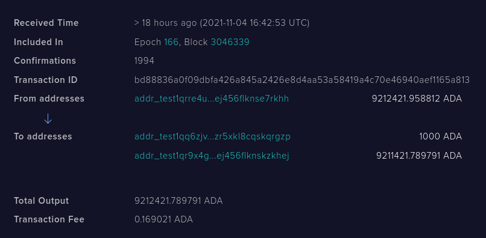

## Instructions for running a public testnet end-to-end integration test

What follows is a series of steps to demonstrate running an end-to-end
integration test of the PAB on the public testnet.

#### Process

Assumptions:

- You have the `plutus-apps` repo checked out at `$PLUTUS`
- You have [jq](https://stedolan.github.io/jq/)
- You have a few hours to wait for everything to sync (the first time.)

Steps:

You will need ~6 terminals to run all the different components.


1. Build all the necessary components:

  ```
  > cd $PLUTUS
  > cabal build plutus-pab-examples plutus-chain-index cardano-node cardano-wallet
  ```

2. Start the testnet node locally:

  ```
  > cd $PLUTUS/plutus-pab/test-node/
  > ./start-testnet-node.sh
  ```

  Note: It's important that this is done from the specific directory, because
  the config paths are relative.

3. Run the cardano wallet backend:

  ```
  > cd $PLUTUS/plutus-pab/test-node/
  > cabal exec -- cardano-wallet serve \
      --testnet testnet/testnet-byron-genesis.json \
      --node-socket testnet/node.sock
  ```

4. Create or restore a public testnet wallet:

  Here you have a few options. You can re-use an existing wallet, or create
  one.

  **Create a new wallet**

  - Generate a recovery phrase:

  ```
  > cabal exec -- cardano-wallet recovery-phrase generate
  ```

  - Save this in a file named `restore-wallet.json` in the `testnet` folder:

  ```
  > cd $PLUTUS/plutus-pab/test-node/
  > cat testnet/restore-wallet.json
  { "name": "PAB testing wallet"
  , "mnemonic_sentence": ["word1", "word2", ...]
  , "passphrase": "pab123456789"
  }
  ```

  - Load the wallet:

  ```
  > cd $PLUTUS/plutus-pab/test-node/
  > curl -H "content-type: application/json" -XPOST \
    -d @testnet/restore-wallet.json \
    localhost:8090/v2/wallets
  ```

  Then, take note of the Wallet ID that is created, and save that:

  ```
  > export WALLET_ID=...
  ```

  - Put some tAda in it, by first obtaining an address:

  ```
  > curl -H "content-type: application/json" \
      -XGET localhost:8090/v2/wallets/0b815c70d6a469dc5bb3cfa806a39999e57f28bd/addresses | jq '.'
  ```

  (Any address will do.)

  - Then, navigate over to the [tesnet
  faucet](https://testnets.cardano.org/en/testnets/cardano/tools/faucet/) and
  send it some tAda.

  You can verify that the transfer has taken place by clicking the link the
  faucet application gives you; you see a transaction like so:

  

5. Start the chain index:

  ```
  > cd $PLUTUS/plutus-pab/test-node/
  > cabal exec -- plutus-chain-index --config testnet/chain-index-config.json start-index
  ```

6. Start the PAB:

  If it's the first time your running, you'll need to ask the PAB to make the
  database:

  ```
  > cd $PLUTUS/plutus-pab/test-node/
  > cabal exec -- plutus-pab-examples \
    --config testnet/pab-config.yml migrate
  ```

  Then, run the PAB

  ```
  > cd $PLUTUS/plutus-pab/test-node/
  > cabal exec -- plutus-pab-examples \
    --config testnet/pab-config.yml webserver \
    --passphrase pab123456789
  ```

7. Wait for all chain clients (`cardano-node`, `cardano-wallet`,
   `plutus-pab-examples`, `plutus-chain-index`) to fully synchronise with the testnet.

  On my computer, the wallet takes about 1 hour, and the chain index takes
  about 3 hours.

  You can check what slot it needs to get up to by checking [the testnet
  explorer](https://explorer.cardano-testnet.iohkdev.io/en); and you can query
  the status of the chain index like so:

  ```
  > curl -s localhost:9083/tip | jq '.tipSlot.getSlot'
  ```

  When it's fully synced the slot should be the same slot that the
  plutus-pab-examples process last printed to the console. Note that the PAB
  process will be silent for a while, after the initial log messages, before
  it starts printing log messages about its sync status.

8. **Start the integration test**

  ```
  > curl -H "Content-Type: application/json" -v -X POST -d \
    '{"caID":{"tag":"IntegrationTest"},"caWallet":{"getWalletId":"$WALLET_ID"}}' \
    localhost:9080/api/contract/activate
  ```

9. Wait for the integration test to finish.

  There will be a message like `"Tx confirmed. Integration test complete."`
  printed from the console running the pab.
